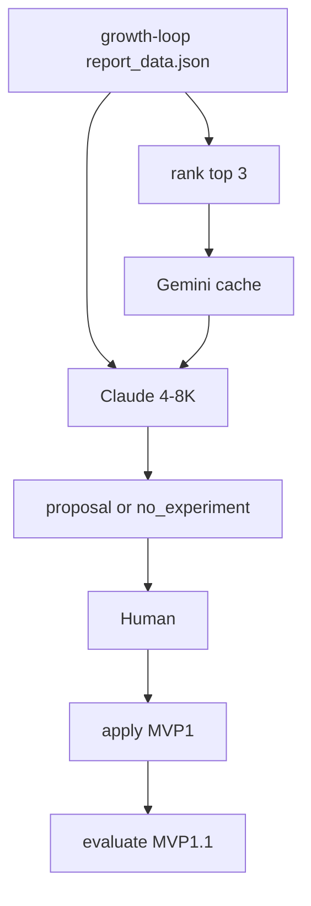

# Landing CTA agent MVP

The original “improve marketing” goal is too abstract. The agent task is:

```text
Given current landing→CTA metrics, current v7 landing, previous experiments,
and the best comparable creatives, propose one experiment that could improve
landing_viewed → landing_cta_clicked — or return no_experiment.
```

V1 objective is only `primary_metric = landing_cta_rate`. Not revenue, UX, or “conversion everywhere.”

**Useful ≠ first variant wins.** Plumbing working (~high) is separate from the first CTA lift (~low). A losing experiment that is logged is still useful. Prove proposal quality before building apply.

---

## Formal I/O

**Input (tools, not this chat):** latest funnel metrics, current v7 landing (structured hero/sections), top 3 comparable creatives + Gemini summaries, last 5 relevant runs.

**Output — exactly one of:**

```json
{
  "decision": "experiment",
  "experimentType": "hero_copy",
  "problem": "...",
  "evidence": ["..."],
  "hypothesis": "...",
  "primaryMetric": "landing_cta_rate",
  "changes": {},
  "otherIdeas": ["...", "..."]
}
```

or

```json
{
  "decision": "no_experiment",
  "reason": "No strong evidence for a change."
}
```

Never invent evidence. Do not force an experiment.

---

## Context budget (production agent, not this conversation)

This planning chat is ~180K and must never be the agent context. Target **4–8K tokens** (intelligence from structured evidence, not a long system prompt):

| Piece | Budget |
|-------|--------|
| `instructions.md` | 800–1,200 |
| CRO playbook | 500–800 |
| Structured current landing | 1,000–1,500 |
| Metrics slice | 500–1,000 |
| Top 3 creative summaries | 1,000–1,500 |
| Last 5 runs (same type) | 500–1,500 |

Do not send: full `report_data.json`, the pricing-lab repo, all runs, landing React source, 100 Gemini dumps, or this conversation.

`get_previous_runs(experiment_type="hero_copy", limit=5)` returns hypothesis / changes / result / learning only.

`get_top_creatives` returns 3 after ranking, not 200.

---

## Milestones

**MVP 0 — is Claude useful?** (1–2 days)  
Build only, in this order: metrics reader → creative ranking → Gemini cache → compact landing reader → previous-runs reader → proposal schema → Claude. **No version schemas, routing, or apply.**

Quality gate uses **different snapshots**, not 10 retries of one week (that only tests model noise):

1. Current week
2. Previous week
3. JPG→SVG-heavy mix
4. Another creative mix
5. Weak / ambiguous data (expect `no_experiment` or a cautious proposal)
6. Already well-matched landing (expect `no_experiment`)
7–10. Remaining distinct report days / mixes if available

For each output, score yes/no:

- Grounded in supplied evidence
- Correctly understands the creatives
- Clear ad→landing mismatch (or correctly sees none)
- One falsifiable hypothesis (N/A if `no_experiment`)
- Minimal `hero_copy` change (N/A if `no_experiment`)
- No unsupported product claim
- Not a duplicate of a previous test
- Would a human actually test it (N/A if `no_experiment` is correct)

`valid` means all of: grounded evidence AND (one falsifiable hypothesis if `experiment`, or a clear reason if `no_experiment`) AND only allowed `hero_copy` fields AND no unsupported claim AND not a duplicate.

**Pass:** ≥8/10 grounded, ≥8/10 valid, ≥7/10 worth testing *or correctly declined*, **0** serious unsupported claims. Fail → fix prompt/context, do not start MVP 1.

MVP 0 model-facing schema is **only** `HeroCopyExperiment | NoExperiment`. Do not put `composition` or `hero_layout` on the Claude output type. Broader union is MVP 1.

**MVP 1 — only if the gate passes:** version schemas → routing → apply writer → guardrails → preview.

**MVP 1.1:** `evaluate` after first real traffic.



## What we are not building now

Postgres, admin UI, PostHog flags, traffic split, auto-promote, scheduler, raw PostHog/ClickHouse, image/video generation, Figma, competitor cloning, write tools for Claude.

## Reality check (unchanged)

- Default `/` is **v7**. Never edit [funnels/v7/steps/landing.yaml](file:///Users/roman/Desktop/all/recraft-pricing-lab/funnels/v7/steps/landing.yaml) — tests require it to match v5/v6.
- Paid volume is **`recraft-quiz` / v6** (~11.9% landing→CTA on 2026-09-17). Label that as a **proxy**. Never say “v7 converts at 11.9%”.
- Measure later by `funnel_version` + `funnel_id`. Not `landing_variant` (template). Not ad-name `_vN`.

---

## Additions from the spec (keep these)

- **Propose vs apply.** `propose` writes only `data/memory/`. `apply <run-id>` writes pricing-lab.
- **Experiment family:** MVP 0 Pydantic type is `HeroCopyExperiment | NoExperiment` only. `composition` / `hero_layout` are added in MVP 1, not hidden by prompt.
- **Split version schemas** in [definitions.ts](file:///Users/roman/Desktop/all/recraft-pricing-lab/src/funnel/engine/definitions.ts):
  - `baseVersionSchema` = `^v[1-9][0-9]*$` → `default_version`
  - `publishedVersionSchema` = `^v[1-9][0-9]*(?:_a[1-9][0-9]*)?$` → `published_versions` + routing
- **Base SHA256** of `v7/steps/landing.yaml` stored on the proposal; `apply` refuses if it drifted.
- **Hard tree diff allowlist** (everything else must match v7):
  - `funnels/v7_aN/funnel.yaml` — `id`, `landingUser` only
  - `funnels/v7_aN/steps/landing.yaml` — fields allowed by `experiment_type`
  - `funnels/site.yaml` — `versions[v7_aN]`, append `published_versions` only
- **Two validates on apply:** variant tree first, then again after `site.yaml` is patched. Final published state must pass.
- **Freshness:** `MAX_REPORT_AGE_HOURS=48`, `MIN_LANDING_PEOPLE=100`. Stale → tell human to run `growth-loop daily`.
- **Creative message-match** as preferred evidence for `hero_copy`. Software ranks ads; Gemini only describes. Rank only comparable traffic (same window, landing family, min spend/clicks).
- **Memory statuses:** `proposed` in MVP 0; `applied` / `rejected` in MVP 1; `evaluate` in 1.1.
- **Build order:** MVP 0 (metrics → ranking → Gemini → landing/history readers → schema → Claude → scored gate) then, only if it passes, MVP 1 (schemas → routing → apply → preview) then 1.1 (`evaluate`). Never write YAML before the gate.

---

## Repo facts that change the spec

### Do not call `funnel:new` as-is

[scripts/funnels.ts](file:///Users/roman/Desktop/all/recraft-pricing-lab/scripts/funnels.ts) sets `id` and `landingUser` to the **folder name**. That breaks two rules:

1. Manifest `id` / `landingUser` are `[a-z0-9-]+` — **`v7_a1` (underscore) is invalid**.
2. Published `funnel_id`s must be unique ([catalog.ts](file:///Users/roman/Desktop/all/recraft-pricing-lab/src/funnel/engine/catalog.ts)). Cannot keep `recraft-quiz-v7`.

Custom copy (or `funnel:new` then immediately rewrite identities):

| Field | Value |
|-------|--------|
| Folder / URL | `v7_a1` |
| `funnel.yaml` `id` | `recraft-quiz-v7-a1` |
| `landingUser` | `pricing-lab-v7-a1` |
| `paywallId` on [plan.yaml](file:///Users/roman/Desktop/all/recraft-pricing-lab/funnels/v7/steps/plan.yaml) | **keep `v7-quiz`** — same paywall, only landing is the experiment |

`funnel:new` also writes `TODO` into `site.yaml` before publish. Apply writes a real description and appends `published_versions` itself. Never change `default_version`.

`apply` must be transactional: work in a temp dir, validate, then move into `funnels/v7_aN` + patch `site.yaml`. On failure, no leftover folder and no half-edited site.

### `/pm` is Vite base, not a React route

[vite.config.ts](file:///Users/roman/Desktop/all/recraft-pricing-lab/vite.config.ts) `base: '/pm/'`. Router sees `/v7_a1`. Unit tests use `/v7_a1` and `/v7_a1/quiz/making`. One real preview: `http://localhost:5173/pm/v7_a1`. Reject `/v1-other` as today.

### Creatives in the report

[model.py](file:///Users/roman/Desktop/all/growth-loop/src/growth_loop/report/model.py) already has `title`, `body`, `ad_name`, `link_url`, spend, impressions, clicks, CTR, `image_path`, video paths, lab `checkouts` / `payments`. **No per-ad landing_people / cta_people.** Never invent those.

Filter to **comparable traffic** before ranking (otherwise a strong ad for another funnel steers copy):

- same report window (current weekly/daily period only — not all-time)
- same destination / landing family (lab hosts / `lp == vercel` / quiz-family URLs, not `/go/*` or unrelated landings)
- drop ads whose `link_url` is missing or points at a different product surface
- minimum spend and clicks (and impressions if present)

Then rank the remainder:

1. lab payments / checkouts
2. qualified spend + clicks
3. CTR / CPC

If nothing survives, omit creative context. Do not send `thumb_b64` / `full_b64` to Claude.

---

## Allowed vs forbidden (one family)

Only [funnels/v7/steps/landing.yaml](file:///Users/roman/Desktop/all/recraft-pricing-lab/funnels/v7/steps/landing.yaml) on the **copy**, never on v7.

- `hero_copy`: hero + `video-cta` + `final-cta` text fields
- `composition`: reorder / omit non-hero sections (`logo-strip`, `showcase`, `style-switcher`, `press-quotes`, `video-cta`, `plan-preview`, `final-cta`)
- `hero_layout`: `layout` (`copy-first` \| `video-first`), `stickyCta`

If `plan-preview` stays, do not change prices, names, or `card` (Pro starts checkout).

MVP 0: `HeroCopyChanges` (headline / subhead / ctaLabel / reassurance / video-cta / final-cta text only). MVP 1 adds a discriminated union for `composition` and `hero_layout`.

---

## Agent repo

Python + uv in [funnel-growth-agent](file:///Users/roman/Desktop/all/funnel-growth-agent).

```text
GROWTH_LOOP_DIR  PRICING_LAB_DIR
ANTHROPIC_API_KEY  ANTHROPIC_MODEL
GEMINI_API_KEY     BASE_VERSION=v7
MAX_REPORT_AGE_HOURS=48  MIN_LANDING_PEOPLE=100
```

Commands:

- `uv run funnel-growth propose` — tools, one proposal, memory only
- `uv run funnel-growth apply <run-id>` — hash, next `v7_aN`, patch, validate twice, atomic publish
- `uv run funnel-growth status`
- `uv run funnel-growth evaluate <run-id>` — MVP 1.1, after real `v7_aN` traffic

Claude read tools only (cap 6–8): `get_landing_cta_metrics`, `get_current_landing`, `get_previous_runs(experiment_type, limit=5)`, `get_top_creatives`, `get_creative_analysis`. Tools return slices, never the raw report.

Invalid model output → no pricing-lab writes (propose never touches that tree anyway).

`instructions.md` and the CRO playbook are **human-edited**. `propose` must not rewrite them. A later `distill` from logs is optional and out of scope.

Playbook must include: match hero to ad intent; primary CTA in the first screen; avoid competing actions; proof near the first CTA if drop-off is early; do not “discover” sticky CTA (v7 already has it); do not repeat a failed family without new evidence.

Claude’s 12-step process and rules from the spec go in `instructions.md` verbatim (landing→CTA only, no checkout/prices/media/IDs, no mixing families, v6 is a proxy, VLM does not pick winners, no unsupported ad claims).

---

## Saved proposal envelope

`propose` writes one JSON object (in memory and as the apply input). Required fields beyond the Pydantic `LandingProposal`:

```json
{
  "runId": "2026-09-18T1640-v7-001",
  "baseVersion": "v7",
  "baseLandingHash": "a91b...",
  "baseline": {
    "source": "growth-loop",
    "funnelId": "recraft-quiz",
    "version": "v6",
    "isProxy": true,
    "landingPeople": 1009,
    "ctaPeople": 120,
    "ctaRate": 0.1189
  },
  "creativeEvidence": [],
  "experimentType": "hero_copy",
  "problem": "...",
  "evidence": ["..."],
  "hypothesis": "...",
  "primaryMetric": "landing_cta_rate",
  "changes": {},
  "otherIdeas": ["...", "..."]
}
```

`creativeEvidence` is a short list copied from ranked creatives / Gemini (`creativeId`, `reasonSelected`, `primaryPromise`, `ctaIntent`). Empty if creatives were omitted.

---

## CLI UX

`propose` prints either `no_experiment` + reason, or problem, proxy baseline, `hero_copy`, hypothesis, changes, other ideas. Last line: `No files were modified`. In MVP 0 do not print apply instructions. MVP 1 adds `Apply with: ...`.

`apply` prints the checklist ticks from the apply section and `http://localhost:5173/pm/v7_aN`. It runs `funnel:validate`, not the full pricing-lab vitest suite (routing tests live in Phase A).

`status` prints base version, existing `v7_a*` folders, latest proposal id/status, latest applied variant, and evaluation if present.

`evaluate` (1.1) prints variant rates vs stored proxy baseline, `causal: false`, and the one-line learning.

---

## Repo layout

```text
funnel-growth-agent/
  pyproject.toml
  src/funnel_growth_agent/
    cli.py
    config.py
    models.py
    metrics.py
    creatives.py
    gemini.py
    landing.py
    memory.py
    agent.py
    proposal.py
    instructions.md
  tests/
    test_models.py
    test_metrics.py
    test_creatives.py
    test_gemini_schema.py
    test_proposal.py
```

Do not create `apply.py`, `guardrails.py`, `evaluate.py`, or their tests in MVP 0.

---

## Memory that can learn later

MVP writes `data/memory/runs.jsonl` only. Every row includes `evaluation` and `learning` from day one so the file does not need a migration:

```json
{
  "runId": "2026-09-18T1640-v7-001",
  "createdAt": "...",
  "status": "proposed",
  "base": "v7",
  "variant": null,
  "proposal": {},
  "deployedAt": null,
  "evaluation": null,
  "learning": null
}
```

Allowed `status` values (reserve all now): `proposed`, `applied`, `rejected`, `deployed`, `measuring`, `evaluated`. MVP 1.0 writes `proposed` / `applied` / `rejected`. MVP 1.1 `evaluate` sets `evaluated`.

`get_previous_runs` always returns those fields. After `apply`, set `variant` to `v7_aN` and `status` to `applied`. `rejected` is a human/status flag, not a new file format.

### MVP 1.1 — `evaluate`

Ship immediately after the first real traffic hits `/pm/v7_aN`. No significance test, no auto-winner.

`uv run funnel-growth evaluate <run-id>` reads the latest report’s `ph_flows` row for that `funnel_version` / `funnel_id`, compares to the proposal’s stored proxy baseline, writes:

```json
{
  "variant": "v7_a1",
  "landingPeople": 800,
  "ctaPeople": 110,
  "ctaRate": 0.1375,
  "baselineProxyRate": 0.1189,
  "causal": false,
  "result": "directionally_better"
}
```

`result` is `directionally_better` | `directionally_worse` | `flat` | `insufficient_data` (below `MIN_LANDING_PEOPLE`). Always `causal: false`. Fill `learning` with one sentence. Next `propose` must read it.

If the variant is missing from the report: `insufficient_data` and tell the human to wait for the next `growth-loop` run.

---

## Cloud and MCP (constraints, not work)

The agent’s only inputs are report JSON, current landing YAML, memory, and optional local creative files. No live PostHog, ClickHouse, or MCP.

The same CLI can run later in Actions/cron if those artifacts are uploaded. Do not build a Vercel app, MCP server, or cloud scheduler in this MVP.

---

## Gemini

`analyze_creative` after deterministic `get_top_creatives` (top 3–5). Strict JSON: visual hook, promise, intent, visible text, claims, suggested landing theme. **No CRO decision.**

- Image: local `image_path` if present
- Video: native if the model accepts the file; else frames at 0/25/50/75/100%
- Cache `data/creative_analysis/{ad_id}.json` by asset fingerprint (`image_sha256` or path+mtime). Refresh on new asset, schema bump, or `--refresh-creatives`
- Missing key / missing file: still propose using `title` + `body` only

Claude instruction: if a few ads drive paid traffic and their promise mismatches the hero, prefer `hero_copy`. Do not copy ad claims the product cannot support.

---

## Metrics payload

Latest weekly `report_data.json`, daily as extra. Software computes.

```json
{
  "baseline": {
    "funnelId": "recraft-quiz",
    "funnelVersion": "v6",
    "isProxy": true,
    "landingPeople": 1009,
    "ctaPeople": 120,
    "ctaRate": 0.1189
  },
  "creatives": []
}
```

`get_current_landing` returns v7 landing YAML as structured sections (no media bytes).

---

## Apply checklist

Final published tree must pass validation, not only the temp folder.

1. Load + revalidate proposal
2. Recheck v7 landing SHA256
3. Next name from existing `v7_a*` folders; refuse overwrite
4. Copy v7 → temp `v7_aN`
5. Set hyphenated unique `id` / `landingUser`; keep `paywallId`
6. YAML Document API patch of landing.yaml only
7. Hard diff vs v7 using the allowlist below
8. `npm run funnel:validate` on the temp variant (must compile)
9. Patch `site.yaml` (`versions[v7_aN]`, append `published_versions`; never `default_version`)
10. `npm run funnel:validate` again on the **full** site (published list + default)
11. Atomic move into place; on any failure roll back temp + site
12. Assert v7 landing bytes unchanged
13. Memory `applied`

Hard-diff allowlist (fail if anything else differs from v7):

```text
funnels/v7_aN/funnel.yaml
  id
  landingUser

funnels/v7_aN/steps/landing.yaml
  fields allowed by experiment_type

funnels/site.yaml
  versions[v7_aN]
  published_versions += v7_aN
```

`paywallId` stays `v7-quiz`. Title on `funnel.yaml` may be set to a fixed human line; if so, add `title` to the allowlist and nowhere else.

Preview: `cd recraft-pricing-lab && npm run dev` → `/pm/v7_a1`. Human checks desktop and mobile: hero, CTA, section order, links, quiz after CTA, plan/paywall, checkout path. Deploy pricing-lab as today. Directional measurement only until a later concurrent A/B.

Note: [catalog.test.ts](file:///Users/roman/Desktop/all/recraft-pricing-lab/src/funnel/engine/catalog.test.ts) lists published funnel ids — apply will fail that test until the list includes `recraft-quiz-v7-a1`. Update that snapshot as part of apply, or make the test derive ids from `site.yaml` (prefer derive so each apply is not a hand-edit).

---

## Tests (required)

- Agent version allowed in `published_versions`, rejected as `default_version`
- `/v7_a1` and `/v7_a1/quiz/making` route; `/v1-other` rejected
- `propose` does not modify pricing-lab
- Forbidden keys / media src / prices / default_version rejected
- Mixed experiment_type rejected
- Stale hash rejected; existing variant not overwritten; v7 unchanged
- `funnel:validate` on generated variant
- Gemini cache hit skips a second call (mock)
- Weak creative data does not block propose
- `get_previous_runs` includes `evaluation` / `learning` (null until evaluate exists)
- `propose` does not modify `instructions.md`
- Hard-diff fails if `site.yaml` or `funnel.yaml` changes anything outside the allowlist
- Apply rolls back if the second `funnel:validate` fails
- Creatives from another landing family / old window are excluded
- `evaluate` writes `insufficient_data` when the variant is absent or below min people; never sets `causal: true`

---

## Definition of done

**MVP 0:** `propose` never touches pricing-lab, stays ~4–8K, can return `no_experiment`, and the scored snapshot gate passes.

**MVP 1:** `v7_a1` can be published and never default; apply allowlist + double validate; `/pm/v7_a1` renders.

**MVP 1.1:** `evaluate` fills directional `evaluation` + `learning`; next `propose` reads last 5 of that type.

## Later

Per-`cta` / device breakdown; concurrent v7 vs `v7_a1` A/B; 10% flags; media-swap proposals; competitive research; optional `distill` of the playbook; same CLI on a cron with uploaded reports. No MCP unless you want the tools inside Cursor chat. No Postgres, Vercel agent host, PostHog flags, admin UI, or autonomous deploy.
